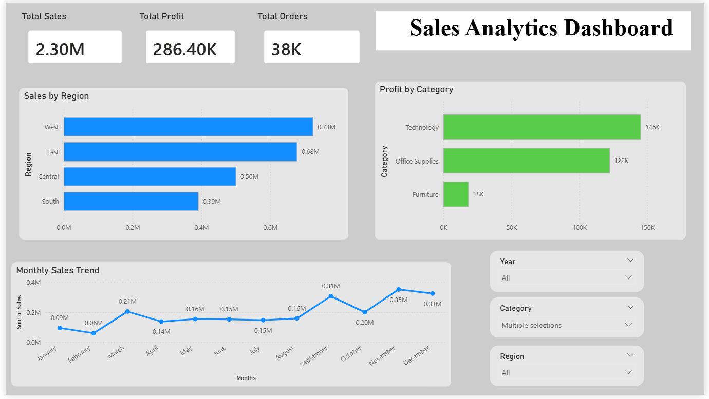

# 📊 Sales Analytics Dashboard

## 📌 Overview

This project presents an interactive Sales Analytics Dashboard built using Power BI. It helps analyze sales performance, profit trends, and regional distribution.

## 🛠 Tools Used

* Power BI
* Excel / CSV dataset

## 📈 Key Insights

* West region has highest sales
* Technology category generates highest profit
* Sales peak during November–December

## 🎯 Features

* KPI cards (Sales, Profit, Orders)
* Sales by Region analysis
* Profit by Category comparison
* Monthly Sales Trend
* Interactive filters (Region, Category, Year)

## 📸 Dashboard Preview

